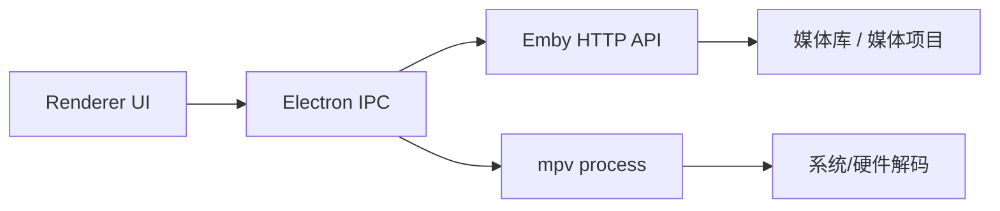

# Qplayer

Qplayer 是一个桌面端 Emby 播放器原型：界面使用 Electron，一套 JavaScript 代码运行在 macOS 和 Windows；播放时把 Emby 直链交给 `mpv`，由 `mpv` 调用系统/硬件解码能力。

## 功能

| 能力 | 当前实现 |
| --- | --- |
| 跨平台桌面 | Electron，提供 macOS / Windows 打包脚本 |
| 播放器 | 优先调用内置 `mpv`，默认参数包含 `--hwdec=auto-safe` |
| Emby | 登录、保存 token、读取媒体库、读取影片/剧集、播放视频流 |
| ExoPlayer | 暂未实现；它更适合 Android 端，Win/mac 版本使用 mpv |

## 开发运行

```bash
npm install
npm start
```

开发运行会优先使用 `vendor/mpv` 里的内置 `mpv`。如果当前平台没有内置文件，再安装 `mpv`，或在登录表单里填写 `mpv` 的完整路径。

## 打包

```bash
npm run dist:mac
npm run dist:win
```

在 macOS 上构建 Windows 安装包通常还需要 Wine；如果本机环境缺失，请在 Windows 或 CI 里执行 `npm run dist:win`。

Windows 包会从 `vendor/mpv/win-x64/mpv.exe` 读取内置播放器，并通过 `extraResources` 打进安装包。

## 架构


